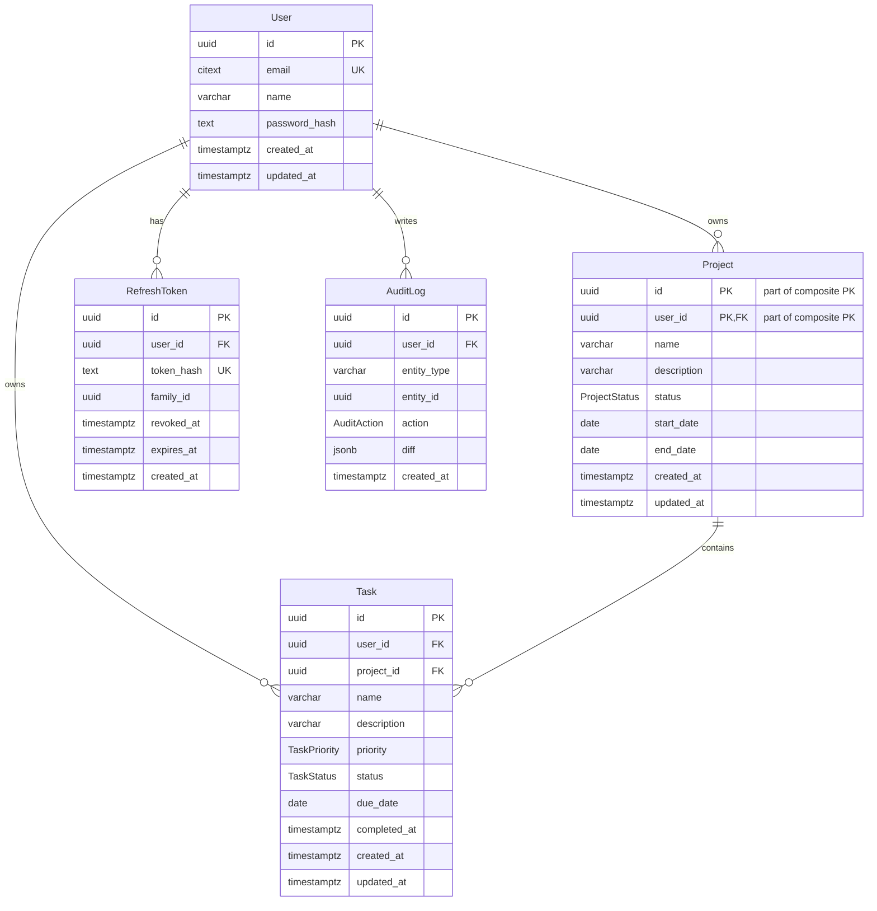

# Orbit Database ER Diagram

Generated from `apps/api/prisma/schema.prisma` and the initial SQL migration.

## Notes

- `users.email` uses `citext` for case-insensitive uniqueness.
- `projects` has a composite primary key on `(id, user_id)`.
- `tasks(project_id, user_id)` references `projects(id, user_id)` so tasks cannot cross account boundaries.
- `projects.end_date >= projects.start_date` is enforced by the initial SQL migration.
- Project and task names use `pg_trgm` GIN indexes for server-side search.
- `refresh_tokens.token_hash` stores only a hash of the opaque refresh token.
- Dashboard counts are derived from `projects` and `tasks` scoped by `user_id`.
- Overdue tasks are computed in the API using the request timezone and the rule `status != COMPLETED AND due_date < local today`.
